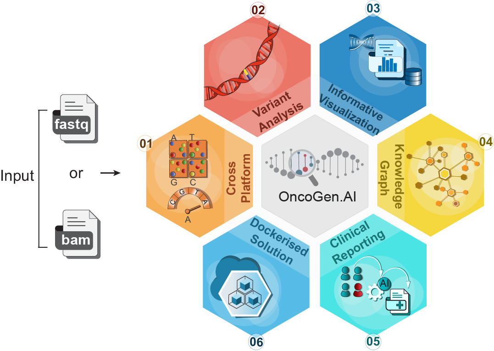

# OncoGen.AI: An Integrated Knowledge-Graph-Driven Platform for Automated Genomic Analysis and Clinical Reporting in Precision Oncology

**OncoGen.AI** is an enterprise-grade, end-to-end clinical genomics platform for the analysis and interpretation of cancer exome data from Illumina and Ion Torrent sequencing. Designed for use in clinical and translational oncology, it integrates robust bioinformatics pipelines, a curated clinical Knowledge Graph, and generative AI-based reporting to bridge the data-to-decision gap in precision medicine.

<br>
<div align="center">
  
</div>
<br>

<p align="left">
  
  
  
  
  
</p>

---

## ✅ Key Features

- Cross-platform input: FASTQ (Illumina) and BAM (Ion Torrent)
- GATK & TVC variant calling with quality filtering
- VEP, ANNOVAR, and InterVar-based variant clinical annotation
- Integrated CNV and TMB analysis
- Curated KG linking to COSMIC, ClinVar, CKG and other clinical databases
- In-app IGV visualization and generative AI-based clinical reporting
- R Shiny-based GUI with full automation from input to clinical report

---

## 📦 Installation

### Install Docker

**Ubuntu/Linux:**
```bash
sudo apt update
sudo apt install docker.io -y
sudo systemctl start docker
sudo systemctl enable docker
```

**Mac/Windows:**  
Download Docker Desktop: [https://www.docker.com/products/docker-desktop](https://www.docker.com/products/docker-desktop)

---

### Access the Docker Image

```bash
wget http://OncoGenAI.ahujalab.iiitd.edu.in:8081/oncogen-ai.tar.gz/ 
gunzip -c oncogen-ai.tar.gz | docker load
```

---

## 🖥️ Running the App

To launch the OncoGen.ai web application with your input and output directories mounted:

```bash
docker run --rm -p 1235:1235 \
  -v /path/to/input-directory:/app-input \
  -v /path/to/output-directory:/OncoGenAI/results \
  ahujalab/oncogenai
```

- Replace `/path/to/input-directory` with the folder containing FASTQ/BAM files
- Replace `/path/to/output-directory` with the folder to store results
- The `--rm` flag ensures that the container is cleaned up after stopping

After execution, access the app at:  
👉 [http://localhost:1235](http://localhost:1235)

---

## 📊 GUI Modules & Usage Flow

### 1️⃣ New Job Submission
- Navigate to **New Job** tab.
- Fill **Patient ID**, details, cancer type, tumor %, and author.
- Select platform (**Illumina** or **Ion Torrent**).
- Choose mutation type (somatic/germline), ref genome (hg19/hg38), and toggle:
  - **Adaptor trimming**
  - **CNV analysis**
- Upload:
  - FASTQ files for Illumina
  - BAM file for Ion Torrent
  - BED file (optional)
- Click **Submit** to initiate the workflow.

### 2️⃣ Running Jobs
- Shows job status in 3 dynamic tables:
  - **Active Jobs**: real-time progress and job ID
  - **Completed Jobs**: list of jobs that have been completed successfully
  - **Aborted Jobs**: for debugging failed runs

### 3️⃣ Variant Filtration
- Choose **3-mode** or **Manual** filtering.
- Adjust thresholds for:
  - QD (Quality by Depth)
  - MQ (Mapping Quality)
  - SOR, ReadPosRankSum, MQRankSum
- Visual output: Histograms for SNP/Indel QD, SOR, MQ, MQRankSum.

### 4️⃣ Basic Variant Exploration
Includes five sub-tabs:

| Sub-tab | Function |
|---------|----------|
| **Variants Number** | Tabular + summary barplot (SNPs, Indels) |
| **SNV Exploration** | SNP tables + heatmaps |
| **Indel Exploration** | Indel tables + density plots |
| **Genomic Features** | Distribution of variants in genomic regions |
| **Variants Relevant Genes** | Gene-specific mutation tables |

### 5️⃣ Clinical Interpretation
Includes four sub-tabs:

| Sub-tab | Function |
|---------|----------|
| **VCF Summary** | Variant class & consequence plots via VEP |
| **Variant Interpretation** | ACMG-based clinical classification via InterVar |
| **Tabular View** | Clickable variant rows; shows ACMG rules |
| **CNV Analysis** | CNVKit + ClassifyCNV with:
  - CNS (segments)
  - CNR (bins)
  - Scoresheet (classification)

### 6️⃣ Genome Browser
- Click **LOCATION** in the “Tabular View”.
- Launches **IGV view** using `igvShiny` for that variant.

### 7️⃣ KG Imputation
- Save filtered variants in **Tabular View**.
- Go to **KG Imputation** tab.
- Query selected variants to get:
  - Associated drugs
  - Disease links
  - Evidence levels from COSMIC, ClinVar, OncoKB, and CKG.

### 8️⃣ Report Generation
- Go to **Report Generation**.
- Select **Job ID** and **Patient ID**.
- Auto-generated query loads from saved KG variant.
- Click to **generate report** using Gemini LLM.
- Output shown in dialog and downloadable.

---

## 📁 Output Files (Host System)

| File Name                 | Description                                 |
|--------------------------|---------------------------------------------|
| `OncogenID_bed_filtered.merged.vcf`       | Final variant calls                         |
| `OncogenID_bed_filtered.merged-vep.vcf`  | VEP-annotated variants          |
| `OncogenID_merged.hg19/hg38_multianno.txt.intervar`     | InterVar-annotated variants                                |
| `OncogenIDcall-cns.csv`     | CNV bins                                    |
| `ClassifyCNV/Scoresheet.txt` | CNV clinical classification                      |
| `OncogenID_somatic_TMB.csv`         | Tumor Mutational Burden table               |
| `OncogenID_kg_results.csv`          | Knowledge Graph associations                |

---

## 🗃️ Directory Structure (Inside Docker)

| Container Path         | Description                          |
|------------------------|--------------------------------------|
| `/app-input`           | User input files (FASTQ/BAM)         |
| `/OncoGenAI/results`   | Result files (by job ID)             |
| `/hg19`, `/hg38`       | Reference FASTA files                | 
| `/exome`, `/panel_file`, `/PON` | Reference & panel files   |
| `/TmbR_scripts`        | Scripts for TMB scoring              |
| `/InterVar-master`, `/annovar` | Clinical interpretation |
| `/vep-hg19`, `/vep-hg38` | Transcript-based annotation |

---

## 🔧 Toolchain & Versions

| Tool               | Version         | Purpose                                |
|--------------------|-----------------|----------------------------------------|
| FastQC             | v0.12.1         | Quality control                        |
| BWA                | v0.7.17         | Alignment                              |
| Samtools           | v1.20           | Indexing, sorting                      |
| GATK               | v4.5.0.0        | Variant calling (Illumina)             |
| TVC                | v5.0-3          | Variant calling (Ion Torrent)          |
| VEP                | v112            | Functional annotation                  |
| ANNOVAR            | 2019Oct24       | Variant annotation                     |
| InterVar           | Updated-2021-08 | ACMG classification                    |
| CNVKit             | v0.9.11         | CNV detection                          |
| ClassifyCNV        | v1.1.1          | CNV interpretation                     |
| TMBleR             | R Package       | TMB estimation                         |
| igvShiny           | v1.0.5          | IGV visualization                      |
| VariantAnnotation  | v1.50.0         | Variant data handling                  |
| GenomicAlignments  | v1.40.0         | Read alignment visualization           |
| Shiny              | v1.9.1          | Web GUI                                |
| Gemini API         | gemini-1.5-flash| Generative AI report writing           |
| VarSome            | v12.6.1         | External clinical variant annotation   |

---

## 📌 Acknowledgments

Special thanks to the developers of: VEP, ANNOVAR, GATK, CNVKit, InterVar, igvShiny, Gemini LLM, VarSome and other open-source libraries used in this project.

---

## 👥 Contributors

Developed by **Ahuja Lab**, IIIT-Delhi & **Rajiv Gandhi Cancer Institute and Research Centre**.

---

## 📄 License

This tool is intended for **academic research and clinical evaluation only**. For commercial licensing inquiries, please contact the maintainers.

---
